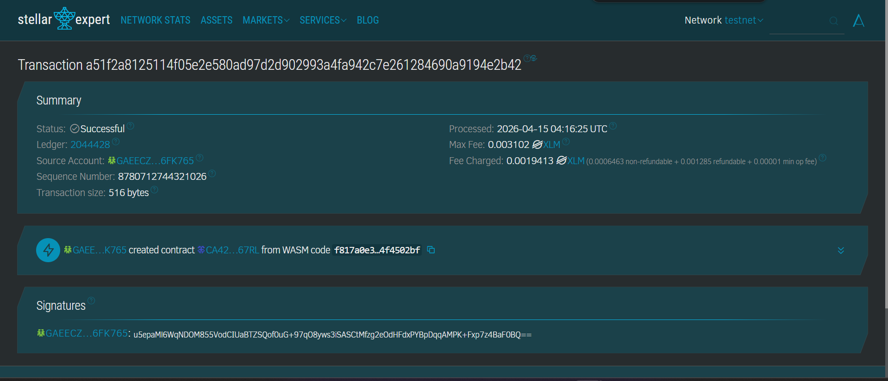

# 🎓 Soroban Student Management Smart Contract

A decentralized student management application built using **Soroban (Stellar Smart Contracts)** and **Rust**.
This smart contract allows users to manage student data directly on the blockchain with simple and efficient CRUD operations.

---

## 📌 Description

This project implements a **Student Management System** on the **Stellar Testnet** using Soroban.
All student data is stored **on-chain**, ensuring transparency, immutability, and decentralization.

The application supports basic operations such as adding, retrieving, and deleting student records, making it a simple example of how blockchain can be used for data management systems.

---

## 🚀 Features

* ➕ Add new student data
* 📄 Retrieve all students
* ❌ Delete student by ID
* 🔢 Auto-increment ID system
* ⛓️ On-chain data storage using Soroban
* ⚡ Lightweight and efficient (no_std Rust)

---

## 🧱 Tech Stack

* **Language**: Rust
* **Framework**: Soroban SDK
* **Blockchain**: Stellar (Testnet)
* **Target**: WebAssembly (WASM)

---

## 📦 Data Structure

```rust
pub struct Mahasiswa {
    id: u64,
    nama: String,
    nim: String,
    jurusan: String,
}
```

---

## ⚙️ Smart Contract Functions

### 1. Get All Students

```rust
get_mahasiswa(env: Env) -> Vec<Mahasiswa>
```

Returns all stored student data.

---

### 2. Add Student

```rust
tambah_mahasiswa(env: Env, nama: String, nim: String, jurusan: String) -> String
```

Adds a new student with an auto-generated ID.

---

### 3. Delete Student

```rust
hapus_mahasiswa(env: Env, id: u64) -> String
```

Deletes a student based on ID.

---

## 🌐 Smart Contract (Testnet)

* **Network**: Stellar Testnet
* **Contract ID**:

```
CADCAIFAUIEIUPQZHOKN6IGZEMJ4LRA76G6CGWB4L25UGNHUAF66JPDW
```

---

## 🧪 Example Usage

### ➕ Add Student

```bash
soroban contract invoke \
  --id CADCAIFAUIEIUPQZHOKN6IGZEMJ4LRA76G6CGWB4L25UGNHUAF66JPDW \
  --fn tambah_mahasiswa \
  --arg "Elberth" \
  --arg "123456" \
  --arg "Information Technology"
```

---

### 📄 Get All Students

```bash
soroban contract invoke \
  --id CADCAIFAUIEIUPQZHOKN6IGZEMJ4LRA76G6CGWB4L25UGNHUAF66JPDW \
  --fn get_mahasiswa
```

---

### ❌ Delete Student

```bash
soroban contract invoke \
  --id CADCAIFAUIEIUPQZHOKN6IGZEMJ4LRA76G6CGWB4L25UGNHUAF66JPDW \
  --fn hapus_mahasiswa \
  --arg 1
```

---

## 📸 Testnet Interface Screenshot

Below is the screenshot of the smart contract interaction on Stellar Testnet:

```
INSERT_SCREENSHOT_HERE
```

> 📌 Replace this with:
> 

---

## 🛠️ Installation & Setup

### 1. Install Rust

```bash
curl https://sh.rustup.rs -sSf | sh
```

---

### 2. Install Soroban CLI

```bash
cargo install soroban-cli
```

---

### 3. Build Contract

```bash
cargo build --target wasm32-unknown-unknown --release
```

---

### 4. Run Tests

```bash
cargo test
```

---

## 📁 Project Structure

```
.
├── src/
│   ├── lib.rs
│   └── test.rs
├── Cargo.toml
└── README.md
```

---

## 🔒 Notes

* Uses **auto-increment ID** instead of random values
* Data is stored directly on-chain
* Designed for learning and demonstration purposes

---

## 🚧 Future Improvements

* ✏️ Update/Edit student data
* 🔍 Search functionality (Sequential & Binary Search)
* 📊 Sorting algorithms (Insertion & Selection Sort)
* 🔐 Authentication system

---

## 👨‍💻 Author

**Elberth Natan Pratama Limbong**

Information Technology - Telkom University

---

## ⭐ Support

If you find this project useful, please consider giving it a ⭐ on GitHub!
